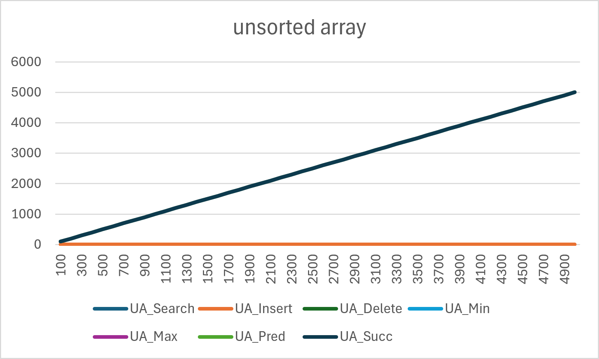
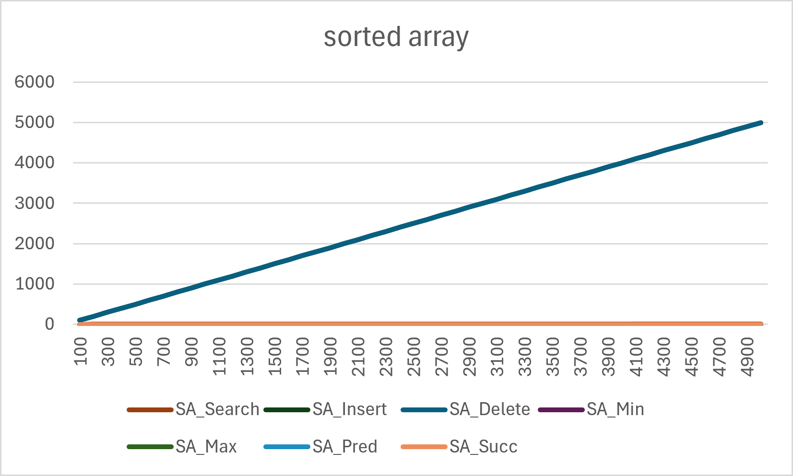
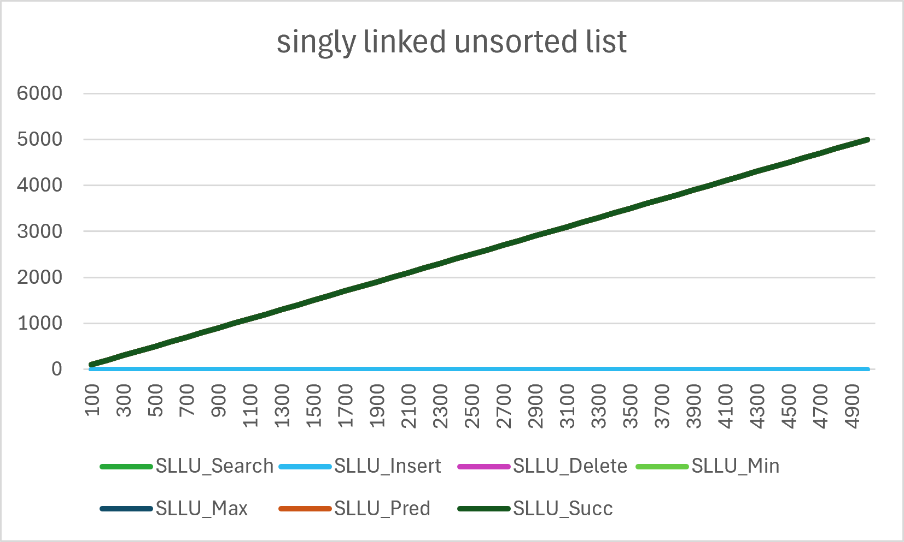
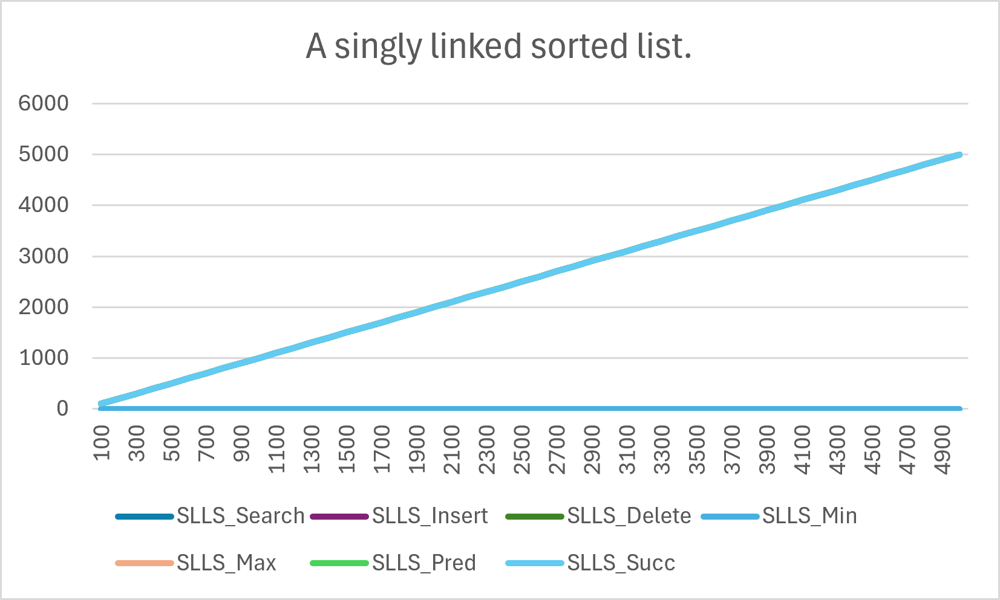
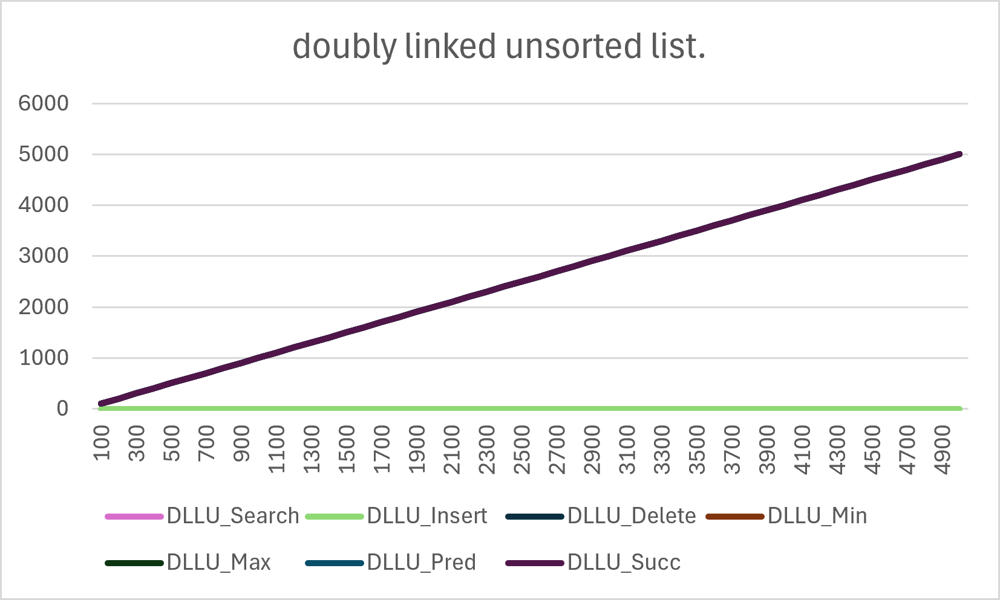
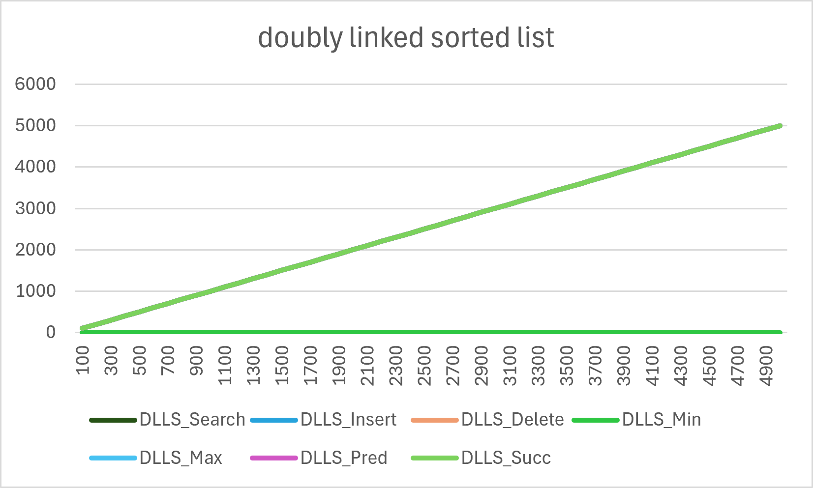

# WEEK 2 – Question 1  
## Dictionary Operations: Analysis of Data Structures

---

## Objective

To analyze the asymptotic worst-case running time of dictionary operations using different data structures and validate the results using graphical analysis.

---

## Operations Considered

- Search(D, k)  
- Insert(D, x)  
- Delete(D, x)  
- Minimum(D)  
- Maximum(D)  
- Predecessor(D, x)  
- Successor(D, x)  

---

## Data Structures Considered

- Unsorted Array  
- Sorted Array  
- Singly Linked List (Unsorted)  
- Singly Linked List (Sorted)  
- Doubly Linked List (Unsorted)  
- Doubly Linked List (Sorted)  

---

## Implementation

- `dictionary_operations.c` → Full implementation of all data structures  
- `csvgenerator.c` → Generates dataset (`dictionary_analysis.csv`)  

The CSV file is used to plot graphs in **Microsoft Excel**.

---

## Graphs

All graphs are generated using:

```text
dictionary_analysis.csv
```

### 1. Unsorted Array


### 2. Sorted Array


### 3. Singly Linked List (Unsorted)


### 4. Singly Linked List (Sorted)


### 5. Doubly Linked List (Unsorted)


### 6. Doubly Linked List (Sorted)


---

## Time Complexity Summary (Worst Case)

| Operation     | Unsorted Array | Sorted Array | SLL (Unsorted) | SLL (Sorted) | DLL (Unsorted) | DLL (Sorted) |
|--------------|---------------|--------------|----------------|--------------|----------------|--------------|
| Search       | O(n)          | O(log n)     | O(n)           | O(n)         | O(n)           | O(n)         |
| Insert       | O(1)          | O(n)         | O(1)           | O(n)         | O(1)           | O(n)         |
| Delete       | O(n)          | O(n)         | O(n)           | O(n)         | O(n)           | O(n)         |
| Minimum      | O(n)          | O(1)         | O(n)           | O(1)         | O(n)           | O(1)         |
| Maximum      | O(n)          | O(1)         | O(n)           | O(n)         | O(n)           | O(n)         |
| Predecessor  | O(n)          | O(1)         | O(n)           | O(n)         | O(n)           | O(n)         |
| Successor    | O(n)          | O(1)         | O(n)           | O(n)         | O(n)           | O(n)         |

---

## Observation

- Sorted array performs best for **search (O(log n))**
- Unsorted structures provide **fast insertion (O(1))**
- Linked lists suffer due to **sequential traversal**
- Sorted structures improve retrieval but increase insertion cost

---

## Conclusion

- No single data structure is optimal for all operations  
- Trade-off exists between:
  - Fast insertion (unsorted)
  - Fast searching (sorted)  
- Choice depends on application requirements  

---

## Files

| File | Description |
|------|-------------|
| `dictionary_operations.c` | Implementation of all structures |
| `csvgenerator.c` | CSV generator |
| `dictionary_analysis.csv` | Data for graphs |
| `Dictionary_Operations.md` | Documentation |

---

## Note

Graphs are plotted using **theoretical step counts** (worst-case complexity), not actual execution time.
