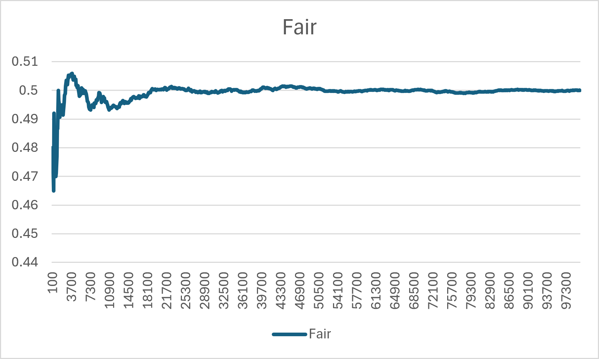
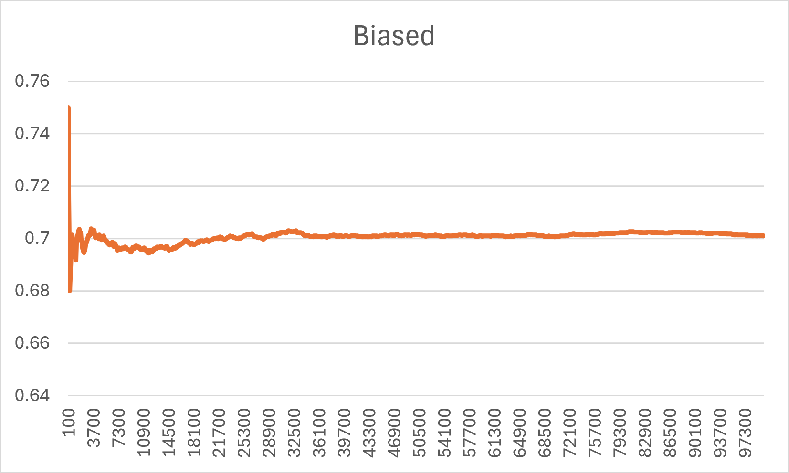

# WEEK 1 – Question 2: Fair vs Biased Coin

## Objective

Using simulation in C, demonstrate that the probability of obtaining a **HEAD** when tossing a fair coin approaches **0.5** as the number of tosses increases. Extend the simulation to compare the behavior of a **fair coin** and a **biased coin**.

---

## Method

Two independent coin-tossing experiments are simulated:

- **Fair Coin:** Probability of HEAD = **0.5**
- **Biased Coin:** Probability of HEAD = **0.7**

The simulation is performed for **100,000 tosses**.

After every **100 tosses**, the experimental probability of obtaining a HEAD is recorded in `results.csv`.

---

## Implementation

The simulation uses the C Standard Library's pseudo-random number generator.

- **Fair Coin**
  - Simulated using `rand() % 2`, giving equal probability to HEAD and TAIL.

- **Biased Coin**
  - A random number between 0 and 1 is generated.
  - If the generated value is less than **0.7**, the outcome is considered a HEAD; otherwise, it is a TAIL.

The calculated probabilities are stored in `results.csv`.

---

## Graphs

The generated `results.csv` file was imported into **Microsoft Excel** to create the graphs.

To improve readability, the results are presented as two separate graphs:

### Fair Coin

### Biased Coin

---

## Observations

- The experimental probability of obtaining a HEAD for the **fair coin** gradually approaches **0.5**.
- The experimental probability of obtaining a HEAD for the **biased coin** gradually approaches **0.7**.
- As the number of tosses increases, the experimental probability becomes increasingly close to the theoretical probability.

This illustrates the **Law of Large Numbers**, which states that the experimental probability converges to the true probability as the number of trials becomes large.

---

## Files

| File | Description |
|------|-------------|
| `fair_vs_biased_coin.c` | C program for the simulation |
| `results.csv` | Simulation data generated by the program |
| `fair.png` | Probability graph for the fair coin (generated from `results.csv` using Microsoft Excel) |
| `biased.png` | Probability graph for the biased coin (generated from `results.csv` using Microsoft Excel) |
| `Fair_VS_Biased_coin.md` | Documentation for Question 2 |
