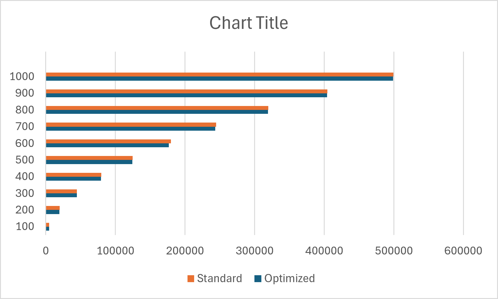

# WEEK 1 – Question 3: Performance Analysis of Bubble Sort

## Objective

Implement and compare two versions of Bubble Sort in C:

1. **Optimized Bubble Sort** – Terminates early if the array becomes sorted before completing all `(n - 1)` passes.
2. **Standard Bubble Sort** – Always completes all `(n - 1)` passes.

The performance of both implementations is compared by counting the number of element comparisons.

---

## Method

Random arrays of increasing sizes are generated.

For each array size:

- The same array is copied for both algorithms.
- Both versions of Bubble Sort are executed independently.
- The total number of comparisons made by each algorithm is recorded.

The results are stored in `comparisons.csv`.

---

## Implementation

### Optimized Bubble Sort

- Uses a **swap flag**.
- If no swaps occur during a pass, the algorithm terminates early.

### Standard Bubble Sort

- Performs all `(n - 1)` passes regardless of whether the array becomes sorted earlier.

---

## Graph

The generated `comparisons.csv` file was imported into **Microsoft Excel** to create the comparison graph.

---

## Observations

- For random arrays, both algorithms perform nearly the same number of comparisons.
- The optimized version is beneficial when the input array is already sorted or nearly sorted because it can terminate early.
- The standard version always performs the complete set of passes regardless of the input.

---

## Files

| File | Description |
|------|-------------|
| `Performance_analysis_of_bubble_sort.c` | C implementation of both Bubble Sort versions |
| `comparisons.csv` | Comparison data generated by the program |
| `comparisons.png` | Graph generated from `comparisons.csv` using Microsoft Excel |
| `Performance_analysis_of_bubble_sort.md` | Documentation for Question 3 |
